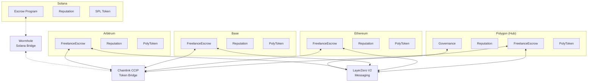

# Cross-Chain PolyLance Implementation Plan
**Architect:** Akhil Muvva  
**Created:** February 12, 2026  
**Status:** 🚧 In Progress

---

## 🎯 Objective

Upgrade the PolyLance freelance marketplace to support seamless job posting, payments, and dispute resolution across **Polygon, Ethereum Mainnet, Solana, Base, and Arbitrum** using **Chainlink CCIP** and **LayerZero V2**. Include native token bridging for reputation and governance tokens.

---

## 🏗️ Architecture Overview

### Supported Chains
1. **Polygon (PoS)** - Primary chain, existing deployment
2. **Ethereum Mainnet** - High-value contracts, institutional clients
3. **Base** - Low-cost L2 for retail users
4. **Arbitrum** - Fast finality, DeFi integrations
5. **Solana** - High throughput, alternative ecosystem (Phase 2)

### Cross-Chain Communication Layers



---

## 📋 Implementation Phases

### **Phase 1: Chainlink CCIP Integration (Week 1-2)**
Enable cross-chain token transfers and job payments.

#### 1.1 CCIP Token Bridge Contract
**File:** `contracts/contracts/ccip/CCIPTokenBridge.sol`

**Features:**
- Lock-and-mint mechanism for PolyToken
- Support for native tokens (ETH, MATIC, etc.)
- Support for stablecoins (USDC, USDT, DAI)
- Automatic fee calculation and payment
- Emergency pause mechanism

**Key Functions:**
```solidity
function bridgeTokensToChain(
    uint64 destinationChainSelector,
    address receiver,
    address token,
    uint256 amount
) external payable returns (bytes32 messageId);

function bridgeJobPayment(
    uint256 jobId,
    uint64 destinationChainSelector,
    address freelancer,
    address token,
    uint256 amount
) external payable returns (bytes32 messageId);
```

#### 1.2 Cross-Chain Escrow Manager
**File:** `contracts/contracts/ccip/CrossChainEscrowManager.sol`

**Features:**
- Manage jobs across multiple chains
- Track cross-chain payment status
- Handle cross-chain refunds
- Synchronize job state across chains

**Key Functions:**
```solidity
function createCrossChainJob(
    uint64 sourceChain,
    uint64 destinationChain,
    CreateParams memory params
) external payable returns (uint256 jobId);

function releaseCrossChainPayment(
    uint256 jobId,
    uint64 destinationChain
) external;
```

#### 1.3 CCIP Receiver Implementation
**File:** `contracts/contracts/ccip/PolyLanceCCIPReceiver.sol`

**Features:**
- Receive and process cross-chain messages
- Validate source chain and sender
- Execute job-related actions (create, release, dispute)
- Emit events for frontend tracking

---

### **Phase 2: LayerZero V2 Integration (Week 2-3)**
Enable cross-chain reputation and governance.

#### 2.1 Omnichain Reputation Token (OFT)
**File:** `contracts/contracts/lz/OmniReputation.sol`

**Features:**
- LayerZero OFT (Omnichain Fungible Token) standard
- Sync reputation scores across all chains
- Weighted reputation based on chain activity
- Anti-gaming mechanisms (time locks, stake requirements)

**Key Functions:**
```solidity
function bridgeReputation(
    uint32 dstEid,
    address to,
    uint256 amount,
    bytes calldata options
) external payable;

function syncReputationScore(
    address user,
    uint32[] calldata chains
) external;
```

#### 2.2 Cross-Chain Governance
**File:** `contracts/contracts/lz/OmniGovernance.sol`

**Features:**
- Propose and vote from any supported chain
- Aggregate votes across all chains
- Execute proposals on target chain
- Quadratic voting with cross-chain verification

**Key Functions:**
```solidity
function createProposal(
    uint32[] calldata targetChains,
    address[] calldata targets,
    bytes[] calldata calldatas,
    string calldata description
) external returns (uint256 proposalId);

function castVoteFromChain(
    uint256 proposalId,
    uint8 support,
    uint32 homeChain
) external payable;

function executeProposal(
    uint256 proposalId,
    uint32 targetChain
) external payable;
```

#### 2.3 Cross-Chain Dispute Resolution
**File:** `contracts/contracts/lz/OmniDispute.sol`

**Features:**
- Initiate disputes from any chain
- Aggregate evidence across chains
- Execute verdicts on source chain
- Cross-chain arbitrator selection

---

### **Phase 3: Solana Integration (Week 4-5)**
Extend to Solana ecosystem using Wormhole.

#### 3.1 Solana Escrow Program
**File:** `solana/programs/polylance-escrow/src/lib.rs`

**Features:**
- Anchor-based escrow program
- SPL token support
- Cross-program invocations (CPI)
- Wormhole message integration

#### 3.2 Wormhole Bridge Adapter
**File:** `contracts/contracts/wormhole/WormholeBridge.sol`

**Features:**
- Bridge between EVM chains and Solana
- Token attestation and wrapping
- Message relaying
- VAA (Verifiable Action Approval) verification

---

### **Phase 4: Frontend Integration (Week 5-6)**

#### 4.1 Multi-Chain Wallet Support
**File:** `frontend/src/hooks/useMultiChain.js`

**Features:**
- Detect and switch between chains
- Display balances across all chains
- Estimate cross-chain fees
- Handle chain-specific transactions

#### 4.2 Cross-Chain Job Creation UI
**File:** `frontend/src/components/CreateCrossChainJob.jsx`

**Features:**
- Chain selector (source and destination)
- Token selector with cross-chain support
- Fee estimation display
- Transaction progress tracking
- Multi-step confirmation flow

#### 4.3 Cross-Chain Dashboard
**File:** `frontend/src/components/CrossChainDashboard.jsx`

**Features:**
- View jobs across all chains
- Track cross-chain transactions
- Display aggregated reputation
- Show governance participation across chains

---

## 🔧 Technical Specifications

### Chainlink CCIP Configuration

#### Supported Chain Selectors
```javascript
const CHAIN_SELECTORS = {
  ETHEREUM_MAINNET: '5009297550715157269',
  POLYGON_MAINNET: '4051577828743386545',
  ARBITRUM_ONE: '4949039107694359620',
  BASE_MAINNET: '15971525489660198786',
  // Testnets
  ETHEREUM_SEPOLIA: '16015286601757825753',
  POLYGON_AMOY: '16281711391670634445',
  ARBITRUM_SEPOLIA: '3478487238524512106',
  BASE_SEPOLIA: '10344971235874465080'
};
```

#### Supported Tokens
```javascript
const SUPPORTED_TOKENS = {
  POLYGON: {
    USDC: '0x3c499c542cEF5E3811e1192ce70d8cC03d5c3359',
    USDT: '0xc2132D05D31c914a87C6611C10748AEb04B58e8F',
    DAI: '0x8f3Cf7ad23Cd3CaDbD9735AFf958023239c6A063',
    POLY: '0xd3b893cd083f07Fe371c1a87393576e7B01C52C6'
  },
  ETHEREUM: {
    USDC: '0xA0b86991c6218b36c1d19D4a2e9Eb0cE3606eB48',
    USDT: '0xdAC17F958D2ee523a2206206994597C13D831ec7',
    DAI: '0x6B175474E89094C44Da98b954EedeAC495271d0F'
  },
  // ... other chains
};
```

### LayerZero V2 Configuration

#### Endpoint Addresses
```javascript
const LZ_ENDPOINTS = {
  ETHEREUM: '0x1a44076050125825900e736c501f859c50fE728c',
  POLYGON: '0x1a44076050125825900e736c501f859c50fE728c',
  ARBITRUM: '0x1a44076050125825900e736c501f859c50fE728c',
  BASE: '0x1a44076050125825900e736c501f859c50fE728c',
  // Testnets
  SEPOLIA: '0x6EDCE65403992e310A62460808c4b910D972f10f',
  AMOY: '0x6EDCE65403992e310A62460808c4b910D972f10f'
};
```

#### Endpoint IDs (EIDs)
```javascript
const LZ_EIDS = {
  ETHEREUM: 30101,
  POLYGON: 30109,
  ARBITRUM: 30110,
  BASE: 30184,
  SOLANA: 30168
};
```

---

## 💰 Fee Structure

### Cross-Chain Transaction Fees

| Operation | CCIP Fee (Est.) | LayerZero Fee (Est.) | Total |
|-----------|----------------|---------------------|-------|
| Token Bridge (< $1000) | $2-5 | N/A | $2-5 |
| Token Bridge (> $1000) | $5-15 | N/A | $5-15 |
| Reputation Sync | N/A | $0.50-2 | $0.50-2 |
| Governance Vote | N/A | $0.50-2 | $0.50-2 |
| Dispute Message | N/A | $1-3 | $1-3 |
| Job Creation (Cross-Chain) | $3-8 | $1-3 | $4-11 |

### Fee Optimization Strategies
1. **Batch Operations**: Combine multiple actions into single cross-chain message
2. **Gas Tokens**: Accept payment in native tokens (ETH, MATIC, etc.)
3. **Subsidized Actions**: Platform subsidizes first cross-chain transaction for new users
4. **Fee Estimation**: Real-time fee quotes before transaction submission

---

## 🔒 Security Considerations

### 1. Cross-Chain Replay Protection
- Unique nonces per chain
- Message hash verification
- Timeout mechanisms for pending messages

### 2. Source Chain Validation
- Whitelist of trusted source chains
- Sender verification (only authorized contracts)
- Rate limiting per source chain

### 3. Token Bridge Security
- Lock-and-mint for custom tokens
- Burn-and-mint for native tokens
- Maximum bridge amount limits
- Emergency pause functionality

### 4. Reputation Anti-Gaming
- Time-weighted reputation scores
- Minimum stake requirements for cross-chain sync
- Cooldown periods between syncs
- Slashing for detected manipulation

---

## 📊 Testing Strategy

### Unit Tests
- [ ] CCIP message encoding/decoding
- [ ] LayerZero message handling
- [ ] Token bridge lock/unlock mechanics
- [ ] Reputation calculation across chains
- [ ] Fee estimation accuracy

### Integration Tests
- [ ] End-to-end job creation and payment across chains
- [ ] Cross-chain reputation synchronization
- [ ] Multi-chain governance voting
- [ ] Dispute resolution across chains
- [ ] Token bridging with multiple tokens

### Testnet Deployment
1. Deploy to Sepolia, Amoy, Base Sepolia, Arbitrum Sepolia
2. Test all cross-chain flows
3. Monitor gas costs and optimize
4. Collect user feedback

---

## 🚀 Deployment Plan

### Week 1-2: CCIP Contracts
- [ ] Deploy CCIPTokenBridge on all EVM chains
- [ ] Deploy CrossChainEscrowManager
- [ ] Configure chain selectors and token mappings
- [ ] Test token bridging on testnets

### Week 2-3: LayerZero Contracts
- [ ] Deploy OmniReputation on all chains
- [ ] Deploy OmniGovernance
- [ ] Configure endpoint addresses and peer mappings
- [ ] Test message passing on testnets

### Week 4-5: Solana Integration
- [ ] Deploy Solana escrow program
- [ ] Deploy Wormhole bridge adapter
- [ ] Test EVM ↔ Solana bridging
- [ ] Integrate with frontend

### Week 5-6: Frontend & Testing
- [ ] Implement multi-chain UI components
- [ ] Add chain switching logic
- [ ] Comprehensive testing on testnets
- [ ] Security audit
- [ ] Mainnet deployment

---

## 📝 Smart Contract Files to Create

### CCIP Contracts
1. `contracts/contracts/ccip/CCIPTokenBridge.sol`
2. `contracts/contracts/ccip/CrossChainEscrowManager.sol`
3. `contracts/contracts/ccip/PolyLanceCCIPReceiver.sol`
4. `contracts/contracts/ccip/interfaces/ICCIPRouter.sol`

### LayerZero Contracts
1. `contracts/contracts/lz/OmniReputation.sol`
2. `contracts/contracts/lz/OmniGovernance.sol`
3. `contracts/contracts/lz/OmniDispute.sol`
4. `contracts/contracts/lz/interfaces/ILayerZeroEndpointV2.sol`

### Wormhole Contracts
1. `contracts/contracts/wormhole/WormholeBridge.sol`
2. `contracts/contracts/wormhole/WormholeReceiver.sol`

### Solana Programs
1. `solana/programs/polylance-escrow/src/lib.rs`
2. `solana/programs/polylance-escrow/src/instructions/`
3. `solana/programs/polylance-escrow/src/state/`

---

## 🎯 Success Metrics

| Metric | Target | Timeline |
|--------|--------|----------|
| Cross-chain job creation | 100+ jobs | Month 1 |
| Total value bridged | $50,000+ | Month 2 |
| Chains with active users | 4/5 chains | Month 2 |
| Cross-chain transaction success rate | > 99% | Ongoing |
| Average cross-chain fee | < $10 | Month 1 |
| Reputation sync accuracy | 100% | Ongoing |

---

## 🔗 Resources

### Documentation
- [Chainlink CCIP Docs](https://docs.chain.link/ccip)
- [LayerZero V2 Docs](https://docs.layerzero.network/v2)
- [Wormhole Docs](https://docs.wormhole.com/)
- [Anchor Framework](https://www.anchor-lang.com/)

### Example Implementations
- [CCIP Token Transfer](https://github.com/smartcontractkit/ccip-starter-kit-foundry)
- [LayerZero OFT](https://github.com/LayerZero-Labs/LayerZero-v2/tree/main/oapp/contracts/oft)
- [Wormhole Token Bridge](https://github.com/wormhole-foundation/wormhole/tree/main/ethereum/contracts)

---

**Next Steps:**
1. Review and approve this implementation plan
2. Set up development environment for multi-chain testing
3. Begin Phase 1: CCIP Integration
4. Create deployment scripts for testnets

**Maintained By:** Akhil Muvva  
**Last Updated:** February 12, 2026
