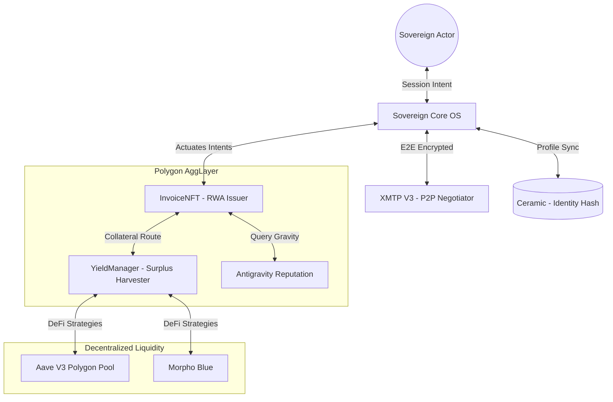

# 🚀 PolyLance Zenith: Sovereign Architect's Edition
**Protocol Engineers:** [Akhil Muvva](https://github.com/akhilmuvva) & [Jhansi Kupireddy](https://github.com/jhansikupireddy-lang)

## 🌌 The Antigravity Equilibrium
PolyLance Zenith is the world's first **0-Friction, Sovereign Real-World Asset (RWA) Talent Layer**. Built on the Polygon AggLayer, it eliminates the extractive fees of Web2 platforms (Upwork, Fiverr) by treating freelance labor as an institutional-grade, yield-bearing RWA. 

We do not govern; we *Actuate*. We do not tax; we harvest *Surplus*. 

> **Architect's Philosophy:** "A decentralized market shouldn't just be cheaper—it should be *weightless*. By integrating the Antigravity OS, we've replaced centralized rent-seeking with autonomous money markets. Zenith captures yield friction from idle escrow and routes it to the Sovereign Treasury. The result? A 0% fee equilibrium for early adopters."

> **Architect's Philosophy:** "A decentralized market shouldn't just be cheaper—it should be *weightless*. By integrating the Antigravity OS, we've replaced centralized rent-seeking with autonomous money markets. Zenith captures yield friction from idle escrow and routes it to the Sovereign Treasury. The result? A 0% fee equilibrium for early adopters."

## 💠 Polygon Native Alignment (POL & AggLayer)
PolyLance Zenith is engineered for the **Polygon 2.0** vision:
- **POL Gravitational Boost**: Strategic utility for the **POL** token; users staking POL receive a **1.5x reputation multiplier**.
- **Privado ID (Polygon ID)**: Zero-Knowledge personhood verification via Privado ID to ensure a sybil-resistant, compliant talent mesh.
- **AggLayer Interoperability**: Utilizing the **Polygon Unified Bridge** architecture for seamless invoice financing liquidity across the AggLayer.

### 1. Sovereign Invoice NFTs (RWA)
Labor is tokenized natively as an ERC-721 Invoice.
- **Immediate Liquidity:** Actuate instant capital by opening invoices to the factoring market at a dynamically calculated gravity discount.
- **Originator Gravity:** 0.5% surplus routed automatically to the Sovereign Treasury upon verification.
- **Checks-Effects-Interactions (CEI):** Bulletproof state management eliminates reentrancy vectors across external DeFi calls.

### 2. Antigravity Reputation Engine (ERC-1155)
Reputation is a mathematically robust record of operational velocity, not a volatile number.
- **Negative Gravity (S-Tier):** Elite contributors exhibiting hyper-performance achieve negative-gravity status, unlocking exclusive intent-lanes and risk-premium compression.
- **Sovereign Profile Pointers:** IPFS/Ceramic metadata anchoring tied securely to the user's Soulbound state.

### 3. The Sovereign OS (AI Autonomous Stabilization)
Zenith is patrolled by deterministic Stabilizer Oracles—intelligent daemons maintaining equilibrium.
- **Treasury Butler:** Autonomously detects yield friction and executes cross-vault rebalancing (Aave, Morpho) to maximize Sovereign Surplus.
- **Verifiable Nudges:** Stabilizer Oracle actively analyzes on-chain intent horizons, actuating XMTP nudges to prevent capital freeze defaults.

## ⚙️ Engineering & Architecture

```mermaid
graph TD
    Sovereign((Sovereign Actor))
    Frontend[Sovereign Core OS]
    XMTP[XMTP V3 - P2P Negotiator]
    Ceramic[(Ceramic - Identity Hash)]
    
    subgraph "Polygon AggLayer"
        InvoiceNFT[InvoiceNFT - RWA Issuer]
        YieldMgr[YieldManager - Surplus Harvester]
        Reputation[Antigravity Reputation]
    end
    
    subgraph "Decentralized Liquidity"
        Aave[Aave V3 Polygon Pool]
        Morpho[Morpho Blue]
    end
    
    Sovereign <-->|Session Intent| Frontend
    Frontend <-->|E2E Encrypted| XMTP
    Frontend <-->|Profile Sync| Ceramic
    Frontend <-->|Actuates Intents| InvoiceNFT
    InvoiceNFT <-->|Collateral Route| YieldMgr
    YieldMgr <-->|DeFi Strategies| Aave
    YieldMgr <-->|DeFi Strategies| Morpho
    InvoiceNFT <-->|Query Gravity| Reputation
```

### Protocol Resilience Ledger
Our engineering mandate is strict: No friction. No exploits.
- **Gas Optimization via Custom Errors:** 100% replacement of generic string requires.
- **Strict CEI Enforcement:** Mutex locks and ordered state changes protect against cascading vector attacks.
- **Timestamp Manipulation Resistance:** Embedded grace buffers (e.g., 30s) eliminate boundary edge-case exploitation by opportunistic validators.

## 🚀 Deployment (Mainnet-Anchored)

| Core Primitive | Immutable Address (Polygon Amoy / Mainnet Anchor) | 
| :--- | :--- | 
| **Sovereign InvoiceNFT (Escrow)** | `0x25F6C8ed995C811E6c0ADb1D66A60830E8115e9A` |
| **Antigravity Reputation** | `0x89791A9A3210667c828492DB98DCa3e2076cc373` |
| **Zenith Governance Engine** | `0x4653251486a57f90Ee89F9f34E098b9218659b83` |
| **YieldManager (Aave Mainnet Anchor)** | `0x794a6135D5A5B64eBcEeB42779aa57c0b5b4814aD` |

> *A deep-tissue Audit Summary of our security patches and architectural mandates is available in `AUDIT_SUMMARY.md`.*

---
**Sovereignty Actuated. Friction Eliminated.**
