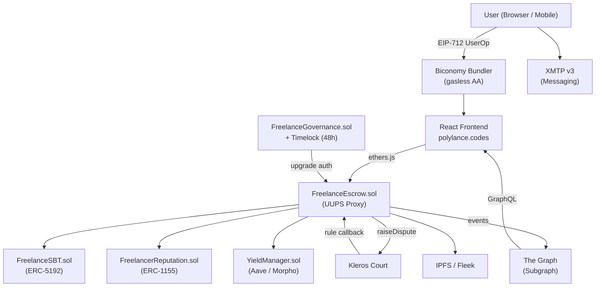

# PolyLance — Decentralized Freelance Marketplace on Polygon

[](LICENSE)
[](contracts/)
[](https://amoy.polygonscan.com)
[](https://polylance.codes)
[](https://github.com/akhilmuvva/polygon-freelance-marketplace/actions)

A trustless freelance coordination protocol on Polygon. Clients and freelancers transact through on-chain milestone escrows with no intermediary — disputes route to Kleros arbitration, reputation is stored as soulbound NFTs, and new users onboard gaslessly via Biconomy Account Abstraction.

**[Live App](https://polylance.codes)** · **[Docs](docs/)** · **[Contract Addresses](#deployed-contracts)**

---

## Tech Stack

| Layer | Technologies |
|---|---|
| Smart Contracts | Solidity 0.8.x, Hardhat, OpenZeppelin, UUPS Proxy |
| Frontend | React, Ethers.js, Biconomy SDK, The Graph |
| Backend | Node.js, Express, MongoDB, IPFS |
| Cross-chain | Solana (Anchor / Rust) |
| Infra | Vercel, Render, The Graph Protocol |
| Security | Slither, Mythril, Kleros arbitration |

---

## Key Features

**Trustless escrow** — milestone-based payments held in a UUPS-upgradeable proxy contract. Funds release only on verified completion; disputes route to Kleros decentralized court.

**Soulbound reputation** — freelancer history minted as ERC-5192 non-transferable NFTs, making reputation portable and Sybil-resistant across the ecosystem.

**Gasless onboarding** — Biconomy Paymaster sponsors the first job post transaction for new wallets, removing the "need ETH to start" barrier entirely.

**On-chain governance** — quadratic voting with commit-reveal schemes (preventing front-running) and liquid delegation to subject-matter experts.

**RWA tokenization** — invoice financing (instant liquidity at 5–30% discount), IP rights fractionalization, and revenue-share token issuance with automated on-chain distribution.

---

## Architecture


```mermaid
graph TD
    User["User (Browser / Mobile)"]
    AA["Biconomy Bundler\n(gasless AA)"]
    Frontend["React Frontend\npolylance.codes"]
    Escrow["FreelanceEscrow.sol\n(UUPS Proxy)"]
    Reputation["FreelancerReputation.sol\n(ERC-1155)"]
    SBT["FreelanceSBT.sol\n(ERC-5192)"]
    Gov["FreelanceGovernance.sol\n+ Timelock (48h)"]
    Yield["YieldManager.sol\n(Aave / Morpho)"]
    Kleros["Kleros Court"]
    Graph["The Graph\n(Subgraph)"]
    IPFS["IPFS / Fleek"]
    XMTP["XMTP v3\n(Messaging)"]

    User -->|EIP-712 UserOp| AA
    AA --> Frontend
    Frontend -->|ethers.js| Escrow
    Escrow --> SBT
    Escrow --> Reputation
    Escrow --> Yield
    Escrow -->|raiseDispute| Kleros
    Kleros -->|rule callback| Escrow
    Gov -->|upgrade auth| Escrow
    Escrow -->|events| Graph
    Graph -->|GraphQL| Frontend
    Escrow --> IPFS
    User --> XMTP
```

---

## Deployed Contracts

| Contract | Address | Explorer |
|---|---|---|
| FreelanceEscrow (UUPS Proxy) | `0x25F6C8ed995C811E6c0ADb1D66A60830E8115e9A` | [View](https://amoy.polygonscan.com/address/0x25F6C8ed995C811E6c0ADb1D66A60830E8115e9A) |
| FreelancerReputation | `0x89791A9A3210667c828492DB98DCa3e2076cc373` | [View](https://amoy.polygonscan.com/address/0x89791A9A3210667c828492DB98DCa3e2076cc373) |
| PolyToken | `0xd3b893cd083f07Fe371c1a87393576e7B01C52C6` | [View](https://amoy.polygonscan.com/address/0xd3b893cd083f07Fe371c1a87393576e7B01C52C6) |
| FreelanceSBT | `0xb4e9A5BC64DC07f890367F72941403EEd7faDCbB` | [View](https://amoy.polygonscan.com/address/0xb4e9A5BC64DC07f890367F72941403EEd7faDCbB) |
| FreelanceGovernance | `0x4653251486a57f90Ee89F9f34E098b9218659b83` | [View](https://amoy.polygonscan.com/address/0x4653251486a57f90Ee89F9f34E098b9218659b83) |

> Network: Polygon Amoy Testnet (Chain ID: 80002)

---

## Quick Start

**Prerequisites:** Node.js 18+, MetaMask, Git

```bash
# 1. Clone and install
git clone https://github.com/akhilmuvva/polygon-freelance-marketplace.git
cd polygon-freelance-marketplace

# 2. Install all dependencies
npm run install:all

# 3. Configure environment
cp contracts/.env.example contracts/.env
cp frontend/.env.example frontend/.env
# Fill in your values — see docs/env-setup.md

# 4. Start dev server
npm run dev
```

---

## Testing

```bash
# Run all contract tests
cd contracts && npx hardhat test

# Generate coverage report
npx hardhat coverage

# Lint smart contracts
npx solhint 'contracts/**/*.sol'
```

Test coverage includes: job lifecycle, milestone escrow, dispute resolution, ERC-5192 SBT compliance, governance voting, and fee logic.

---

## Deployment

Full guide in [docs/deployment.md](docs/deployment.md).

```bash
# Deploy to Polygon Amoy testnet
npm run deploy:contracts

# Verify on Polygonscan
npx hardhat verify --network polygon_amoy <CONTRACT_ADDRESS>
```

---

## Security

Smart contracts audited with Slither and Mythril. Reports in [docs/security/](docs/security/).

Key protections: UUPS proxy pattern for upgradeability, pull-based payment settlements (DoS-resistant), reputation-gated governance (Sybil-resistant), reentrancy guards on all fund flows.

To report a vulnerability, see [SECURITY.md](SECURITY.md).

---

## Project Structure

```
polygon-freelance-marketplace/
├── contracts/          # Hardhat project — 42 Solidity contracts
├── frontend/           # React application (Vite)
├── subgraph/           # The Graph subgraph schema and mappings
├── solana/             # Anchor cross-chain program (Rust)
├── docs/               # Architecture, deployment, security, RWA guides
│   └── security/       # Slither and Mythril audit reports
└── .github/workflows/  # CI/CD pipelines
```

---

## Contributing

See [CONTRIBUTING.md](CONTRIBUTING.md) for setup instructions, branch naming, and PR checklist.

---

## Changelog

See [CHANGELOG.md](CHANGELOG.md).

---

## Contributors

| Name | GitHub |
|---|---|
| Muvva Akhil Yadav | [@akhilmuvva](https://github.com/akhilmuvva) |
| Jhansi Kupireddy | [@jhansikupireddy-lang](https://github.com/jhansikupireddy-lang) |

---

## Repository Setup

> **For the repository owner:** Set the following on the GitHub repository settings page to maximize discoverability.
>
> **Description:** `Decentralized freelance marketplace on Polygon with trustless escrow, RWA tokenization, and gasless onboarding via Account Abstraction.`
>
> **Topics:** `polygon` `solidity` `defi` `web3` `freelance` `smart-contracts` `ethereum` `hardhat` `ipfs` `the-graph` `account-abstraction` `kleros` `nft` `react` `uups-proxy`
>
> **Website:** `https://polylance.codes`

---

## License

MIT — see [LICENSE](LICENSE).
