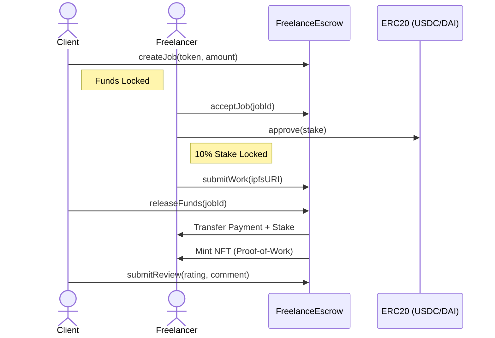

# 🚀 PolyLance: Enterprise Decentralized Freelance Marketplace

PolyLance is a high-performance, professional freelance ecosystem built on the Polygon network. It enables secured escrow payments, milestone-based job tracking, on-chain reputation systems, and NFT-based proof-of-work.


## ✨ Features

- **🛡️ Secure Escrow**: Funds are locked in smart contracts and released only when work is approved.
- **🏗️ Milestone Payments**: Complex jobs can be broken down into multiple verifiable milestones.
- **⚖️ Dispute Resolution**: Integrated arbitration system for fair conflict resolution.
- **⭐ On-Chain Reputation**: Verified reviews and ratings stored directly on the blockchain.
- **🖼️ NFT Proof-of-Work**: A unique NFT is minted for every completed job, serving as a permanent record of achievement.
- **💰 Multi-Token Support**: Pay in MATIC, USDC, or DAI.
- **💬 Real-Time Messaging**: Secure wallet-to-wallet chat powered by XMTP.
- **🔍 Advanced Search**: Filter jobs by category, budget, and search queries.

## 📸 Interface Preview

| Dashboard | Job Market | Create Job |
|-----------|------------|------------|
|  |  |  |

## 🛠️ Technology Stack

- **Frontend**: React, Vite, Framer Motion, Lucide React, Tailwind CSS (Vanilla CSS focus).
- **Web3**: Wagmi, Viem, RainbowKit, WalletConnect v2, XMTP.
- **Smart Contracts**: Solidity (0.8.20), OpenZeppelin, Hardhat.
- **Backend**: Node.js, Express, MongoDB, Mongoose.
- **Indexing**: Custom blockchain event syncer for real-time data.

## 🚀 Getting Started

### Prerequisites

- Node.js (v18+)
- MongoDB
- MetaMask or any Web3 Wallet

### Installation

1. **Clone the repository**:
   ```bash
   git clone https://github.com/your-repo/polygon-freelance-marketplace.git
   cd polygon-freelance-marketplace
   ```

2. **Setup Backend**:
   ```bash
   cd backend
   npm install
   cp .env.example .env # Add MONGODB_URI
   npm run dev
   ```

3. **Setup Frontend**:
   ```bash
   cd frontend
   npm install
   # Update VITE_WALLETCONNECT_PROJECT_ID in .env
   npm run dev
   ```

4. **Setup Smart Contracts**:
   ```bash
   cd contracts
   npm install
   npx hardhat compile
   ```

## 📜 Smart Contract Logic

The `FreelanceEscrow.sol` contract manages the job lifecycle:
1. **Creation**: Client deposits MATIC/USDC/DAI into escrow.
2. **Acceptance**: Freelancer stakes 10% as a commitment bond.
3. **Execution**: Work is submitted via IPFS/metadata URI.
4. **Finalization**: Client releases funds, freelancer gets stake back + payment, and an NFT is minted.

### Architecture Loop



## 🛡️ Security

- **ReentrancyGuard**: All fund-transferring functions are protected.
- **Access Control**: Ownable patterns for administrative tasks.
- **Audit**: Comprehensive security notes available in `contracts/AUDIT.md`.

## 📈 Scalability

PolyLance is built with a custom indexing strategy documented in `contracts/SUBGRAPH.md` to ensure low-latency data fetching as the marketplace grows.

## 📄 License

Distributed under the MIT License. See `LICENSE` for more information.
