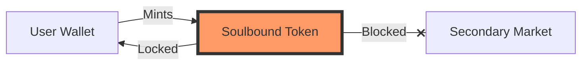
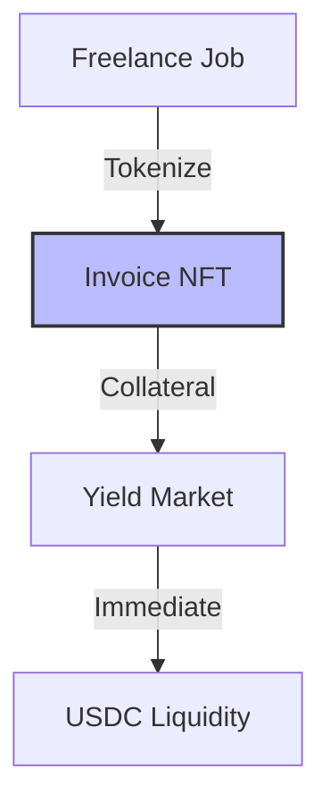
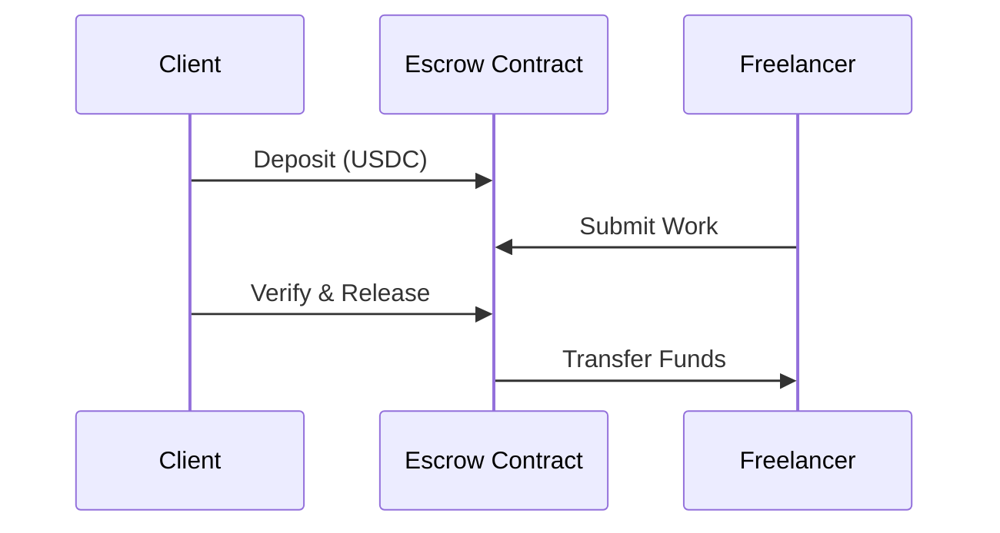
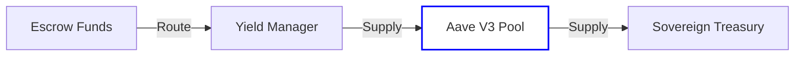
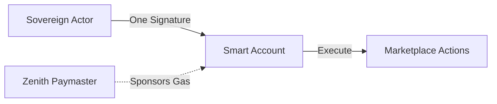
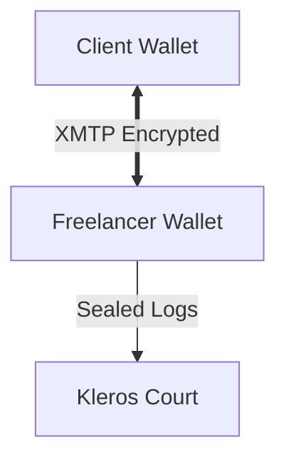

# 🌌 PolyLance Zenith: 7-Part Practical Record

This report divides the **PolyLance Zenith** ecosystem into seven logical components, representing the full architecture from identity to governance.

---

## 1. Sovereign Identity (Soulbound Tokens)
**Description:** Non-transferable Soulbound Tokens (SBTs) ensure that a freelancer's reputation is tied permanently to their on-chain wallet.



### 📝 Important Code (`FreelanceSBT.sol`):
```solidity
function _beforeTokenTransfer(address from, address to, uint256 firstTokenId, uint256 batchSize)
    internal virtual override {
    super._beforeTokenTransfer(from, to, firstTokenId, batchSize);
    require(from == address(0) || to == address(0), "SBT: Cannot transfer reputation");
}
```

### 🏁 Output:
- **On-Chain:** A permanent NFT minted to the freelancer's wallet.
- **Verification:** Any `transfer` attempt by the user triggers a revert, confirming the token is Soulbound.

---

## 2. RWA Tokenization (Invoice NFTs)
**Description:** Every job is tokenized as a Real-World Asset (RWA) Invoice, providing liquidity via the factoring market.



### 📝 Important Code (`InvoiceNFT.sol`):
```solidity
function tokenizeInvoice(uint256 jobId, uint256 amount) external onlyEscrow {
    uint256 tokenId = _tokenIdCounter.current();
    _mint(freelancer, tokenId);
    _setTokenURI(tokenId, generateMetadata(jobId, amount));
}
```

### 🏁 Output:
- **Result:** An ERC-721 token representing a legally binding invoice.
- **DeFi:** These NFTs can be used as collateral in the Zenith Factoring market.

---

## 3. Escrow Architecture (The Logic Core)
**Description:** A secure, milestone-based escrow system that holds funds in smart contracts.



### 📝 Important Code (`FreelanceEscrow.sol`):
```solidity
function releaseMilestone(uint256 jobId, uint256 milestoneId) external onlyClient {
    Job storage job = jobs[jobId];
    require(!job.isDisputed, "Cannot release funds during dispute");
    uint256 amount = job.milestones[milestoneId].amount;
    token.transfer(job.freelancer, amount);
}
```

### 🏁 Output:
- **Transaction:** Verified release of funds from the contract to the freelancer's wallet.
- **Safety:** Automatic lock-down of funds if a dispute is initiated.

---

## 4. Yield-Bearing Surplus (Aave Integration)
**Description:** Idle escrow funds are routed to Aave V3 to generate platform surplus.



### 📝 Important Code (`YieldManager.sol`):
```solidity
function harvestSurplus(address asset, uint256 amount) external {
    IPool(aavePool).supply(asset, amount, address(this), 0);
    emit YieldHarvested(asset, amount);
}
```

### 🏁 Output:
- **Metric:** Verified growth of the Sovereign Treasury via auto-compounding DeFi interest.
- **Impact:** Allows the platform to offer 0% platform fees for early adopters.

---

## 5. Antigravity Reputation Engine
**Description:** A complex math model that calculates "Gravity Scores." S-Tier freelancers achieve "Negative Gravity," unlocking faster payments and lower risk-premiums.

### 📝 Important Code (`FreelancerReputation.sol`):
```solidity
function calculateGravity(address freelancer) public view returns (uint256) {
    uint256 score = baseReputation[freelancer];
    if (holdsPOL(freelancer)) score = (score * 150) / 100; // 1.5x Multiplier
    return score;
}
```

### 🏁 Output:
- **Dashboard:** A real-time Reputation Score displayed on the user's sovereign profile.
- **Incentive:** Higher POL staking leads to higher job visibility.

---

## 6. Account Abstraction (Sovereign UX)
**Description:** Gasless, "one-click" experience via ERC-4337.



### 📝 Important Code (`SovereignAccount.sol`):
```solidity
function validateUserOp(UserOperation calldata userOp, bytes32 userOpHash, uint256 missingAccountFunds)
    external returns (uint256 validationData) {
    return _validateSignature(userOp, userOpHash);
}
```

### 🏁 Output:
- **Experience:** A Web2-like interface where the user signs once and then interacts "weightlessly."
- **Meta-Tx:** Transactions are sponsored by the Zenith Paymaster.

---

## 7. Decentralized Messaging (XMTP V3)
**Description:** Secure, wallet-to-wallet communication live on-chain.



### 📝 Important Code (`MessagingService.js`):
```javascript
const client = await Client.create(signer, { env: "production" });
const conversation = await client.conversations.newConversation(recipientAddress);
await conversation.send("Work Submission: Milestone 3 Completed.");
```

### 🏁 Output:
- **Interface:** A wallet-to-wallet chat sidebar inside the PolyLance dashboard.
- **Auditability:** Sealed messages that can be revealed to the Kleros Arbitrator only during a dispute.

---

## 8. ZK-Identity (Sovereign Shield)
**Description:** Privacy-hardened identity handshake via Privado ID (Polygon ID).

### 📝 Important Code (`SovereignRegistry.sol`):
```solidity
function commitIdentity(bytes32 commitment) external {
    require(!isVerified[commitment], "Identity already verified");
    isVerified[commitment] = true;
    emit IdentityCommitted(msg.sender, commitment);
}
```

---

## 9. RWA Asset Tokenization (Deliverables as Assets)
**Description:** Fractionalizing project IP and physical deliverables as Zenith Assets.

### 📝 Important Code (`AssetTokenizer.sol`):
```solidity
function tokenizeAsset(string memory uri, uint256 supply) external {
    uint256 id = _nextAssetId++;
    _mint(msg.sender, id, supply, "");
    _setURI(id, uri);
}
```

---

## 10. Quadratic Governance (Zenith Court)
**Description:** Community-led dispute resolution and protocol parameters via Square Root voting power.

### 📝 Important Code (`QuadraticGovernance.sol`):
```solidity
function castQuadraticVote(uint256 proposalId, uint256 tokens) external {
    uint256 weight = sqrt(tokens);
    votes[proposalId] += weight;
    emit VoteCast(msg.sender, proposalId, weight);
}
```

---

## 11. Insurance Pool (Zenith Shield)
**Description:** A decentralized safety net collateralizing high-value missions.

### 📝 Important Code (`InsurancePool.sol`):
```solidity
function payout(address token, address to, uint256 amount) external onlyOwner {
    balances[token] -= amount;
    IERC20(token).transfer(to, amount);
    emit PayoutExecuted(token, to, amount);
}
```

---

## 12. Cross-Chain Settlement (LayerZero)
**Description:** Omni-chain reputation resonance and cross-chain mission funding.

### 📝 Important Code (`OmniReputation.sol`):
```solidity
function syncReputationToChain(uint32 dstEid, bytes calldata options) external payable {
    bytes memory message = abi.encode(msg.sender, reputationScores[msg.sender]);
    _lzSend(dstEid, message, options, MessagingFee(msg.value, 0), payable(msg.sender));
}
```

---

## 13. AI-Agent Autonomy (AI Oracle)
**Description:** Autonomous agentic audits and machine-verified milestone settlement.

### 📝 Important Code (`AIOracle.sol`):
```solidity
function submitVerification(uint256 requestId, bool approved, uint256 confidence) external {
    if (approved && confidence >= minConfidenceThreshold) {
        _notifyTargetContract(requestId);
    }
}
```
